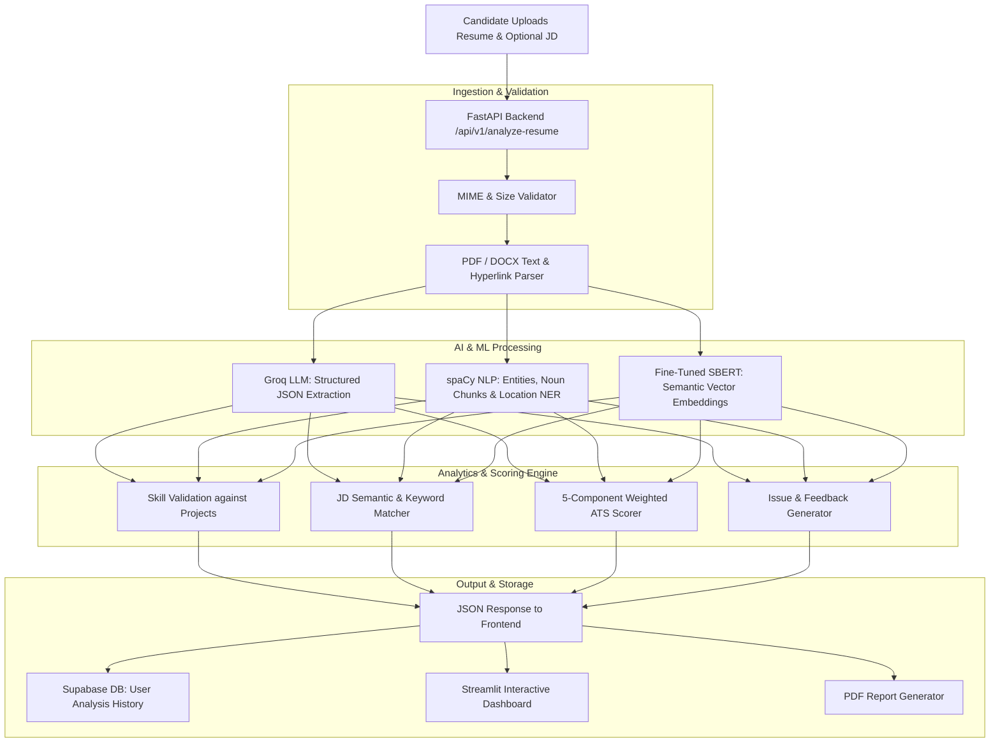

# 🎯 AI-Powered ATS Resume Scorer & Analyzer


## 📌 Executive Summary

**AI-Powered ATS Resume Scorer** is an intelligent, end-to-end recruitment technology platform that simulates enterprise Applicant Tracking Systems (ATS). It evaluates candidates' resumes against job descriptions using **Hybrid AI (Fine-tuned SBERT + Groq LLM + spaCy NLP + RapidFuzz)**, validates claimed skills against real projects, provides granular section-by-section scoring (0–100), detects formatting/privacy vulnerabilities, and produces downloadable PDF diagnostic reports.

---

## 🌟 Key Features

### 📄 1. Robust Multi-Format Document Parsing
- **PDF Extraction**: Primary parsing using `pdfplumber` with fallback to `PyPDF2`. Extracts visual layers and embedded hyperlinks (GitHub, LinkedIn, portfolio).
- **DOCX Extraction**: Extracts formatted text, tabular content, and embedded hyperlinks.
- **Safety & Validation**: Enforces MIME type verification, empty file checks, and size validation (up to 5 MB).

### 🤖 2. Hybrid NLP & LLM Semantic Engine
- **LLM Structured Parser (Groq API)**: Extracts deep structured JSON (skills, experience duration, project descriptions, action verbs, ATS keywords).
- **Fine-Tuned SBERT Matcher**: Generates high-dimensional semantic embeddings to calculate cosine similarity between resumes and job descriptions.
- **spaCy Named Entity Recognition (NER)**: Identifies organizations, technologies, products, and noun chunks for skill gap analysis.
- **Intelligent Fuzzy Matching**: Uses `RapidFuzz` with canonical alias mapping (e.g., `k8s` $\rightarrow$ `kubernetes`, `reactjs` $\rightarrow$ `react`, `golang` $\rightarrow$ `go`) to avoid false-negative keyword penalties.

### 🔍 3. Skill-to-Project Cross-Validation
- Automatically cross-examines listed skills against actual bullet points in the **Projects** and **Experience** sections using semantic cosine similarity.
- Highlights unvalidated "buzzword" skills that lack contextual proof in project descriptions.

### 📊 4. 5-Tier ATS Scoring System (100 Total Points)
- **Formatting Score (20 pts)**: Essential sections, bullet-point hygiene, structured hierarchy.
- **Keywords Score (25 pts)**: Resume keyword density, skills volume, and JD keyword alignment.
- **Content Quality Score (25 pts)**: Action verbs, quantifiable metrics/achievements, grammar penalties.
- **Skill Validation Score (15 pts)**: Proportion of skills substantiated by projects/work history.
- **ATS Compatibility Score (15 pts)**: Privacy check (address/zip risk), parsing cleanliness, contact details.

### 💡 5. Actionable Feedback & Privacy Auditing
- **Severity-tagged feedback**: Categorized into *Critical*, *High*, *Medium*, and *Low*.
- **Privacy Audit**: Detects sensitive PII like full street addresses and pin/zip codes that pose privacy risks or confuse ATS parsers.
- **Strengths & Quick Fixes**: Highlights what the resume did well and provides immediate action items for improvement.

### 📥 6. Professional PDF Report Generation
- Renders Jinja2 HTML templates styled for clean print pagination.
- Generates downloadable, comprehensive PDF reports for offline review.

### 🔐 7. Supabase Authentication & History
- User registration, login, and Google OAuth via Supabase Auth.
- Secure storage of previous resume analyses with Row-Level Security (RLS).
- History view allowing users to re-inspect past scores or export PDF reports anytime.

---

## 🏗️ Architecture & Pipeline Flow



---

## 📊 ATS Scoring Matrix

| Component | Max Points | Evaluation Criteria |
| :--- | :---: | :--- |
| **Formatting** | **20** | Presence of Experience, Education, Skills, Summary, Projects; bullet point distribution; structural balance. |
| **Keywords** | **25** | Total technical keywords count, skills diversity, and fuzzy keyword overlap with the Job Description. |
| **Content Quality** | **25** | Strong action verbs (*spearheaded, architected*), quantifiable metrics ($/%, numbers), grammar hygiene. |
| **Skill Validation** | **15** | Percentage of listed skills backed by evidence in project descriptions or work experience. |
| **ATS Compatibility** | **15** | Contact information completeness, file parseability, and absence of unnecessary PII (full address/zip). |
| **Total** | **100** | **Comprehensive ATS Readiness Score** |

---

## 📁 Repository Structure

```
ats_scorer/
├── backend/
│   ├── api/
│   │   ├── auth.py              # Supabase JWT authentication dependency
│   │   └── routes.py            # FastAPI REST API endpoints
│   ├── core/
│   │   └── config.py            # App configurations, weights, and environment variables
│   ├── database/
│   │   └── supabase_db.py       # Supabase REST client for analysis persistence & history
│   ├── models/
│   │   └── schemas.py           # Pydantic data schemas and validation models
│   ├── services/
│   │   ├── ats_scorer.py        # Core 5-tier scoring algorithms & privacy audit
│   │   ├── feedback_engine.py   # Rule-based diagnostic issue generator
│   │   ├── groq_parser.py       # Groq LLM structured resume & JD parser
│   │   ├── jd_matcher.py        # Semantic similarity & skill gap matching
│   │   ├── pdf_export.py        # HTML-to-PDF conversion engine
│   │   ├── recommendation_engine.py # Custom improvement suggestions
│   │   ├── report_generator.py  # Jinja2 template renderer
│   │   ├── resume_analyzer.py   # Master orchestrator combining all services
│   │   └── resume_parser.py     # PDF (pdfplumber/PyPDF2) and DOCX text extraction
│   ├── templates/               # Jinja2 HTML templates for PDF reports
│   ├── utils/
│   │   ├── file_utils.py        # Logging helpers, fallback wrappers, and safe defaults
│   │   └── matching.py          # Fuzzy matching & skill alias dictionary
│   ├── requirements.txt         # Backend Python dependencies
│   └── main.py                  # FastAPI application entry point with lifespan events
├── frontend/
│   ├── assets/
│   │   └── styles.css           # Custom CSS styling for Streamlit UI
│   ├── components/              # Modular UI widgets (scores, charts, feedback, skills)
│   ├── services/                # API client & Supabase auth client
│   ├── views/                   # Views: Landing, Scorer, History, Resources
│   └── streamlit_app.py         # Streamlit main dashboard entry point
├── ml_model/
│   └── sbert_resume_matcher/    # Fine-tuned SentenceTransformer model weights & tokenizer
├── jupyter notebook/            # Training & Exploratory Data Analysis notebooks
├── .env                         # Local environment configuration file
└── README.md                    # Project documentation
```

---

## 🚀 Getting Started

### 1. Prerequisites
- **Python**: Version 3.10, 3.11, or 3.12
- **Groq API Key**: Free tier or paid API key from [Groq Console](https://console.groq.com)
- **Supabase Account**: Free project from [Supabase](https://supabase.com)

---

### 2. Clone the Repository
```bash
git clone https://github.com/your-username/ats_scorer.git
cd ats_scorer/ats_scorer
```

---

### 3. Create & Activate Virtual Environment
```bash
# Windows (PowerShell)
python -m venv venv
.\venv\Scripts\Activate.ps1

# Linux / macOS
python3 -m venv venv
source venv/bin/activate
```

---

### 4. Install Dependencies & spaCy Models
```bash
# Install required Python packages
pip install -r backend/requirements.txt
pip install streamlit rapidfuzz weasyprint python-dotenv httpx

# Download spaCy English NLP models
python -m spacy download en_core_web_md
python -m spacy download en_core_web_sm
```

---

### 5. Configure Environment Variables
Create a `.env` file in the root `ats_scorer` directory:

```env
# Groq API Configuration
GROQ_API_KEY=gsk_your_groq_api_key_here

# Supabase Configuration
SUPABASE_URL=https://your-project-id.supabase.co
SUPABASE_KEY=your_supabase_service_role_key
SUPABASE_ANON_KEY=your_supabase_anon_public_key
SUPABASE_JWT_SECRET=your_supabase_jwt_secret

# ML Model Path
SENTENCE_TRANSFORMER_MODEL=ml_model/sbert_resume_matcher
```

---

### 6. Set Up Supabase Database Table
Run the following SQL query in your Supabase SQL Editor:

```sql
create table analyses (
  id uuid primary key default gen_random_uuid(),
  user_id uuid references auth.users(id) on delete cascade,
  filename text not null,
  ats_score numeric default 0,
  keyword_match numeric default 0,
  missing_keywords jsonb default '[]'::jsonb,
  analysis_result jsonb not null,
  created_at timestamp with time zone default now()
);

-- Enable Row Level Security (RLS)
alter table analyses enable row level security;

-- Create policy for user access
create policy "Users can read own analyses"
  on analyses for select
  using (auth.uid() = user_id);

create policy "Users can insert own analyses"
  on analyses for insert
  with check (auth.uid() = user_id);

create policy "Users can delete own analyses"
  on analyses for delete
  using (auth.uid() = user_id);
```

---

### 7. Run the Application

#### Start the FastAPI Backend:
```bash
# From the project root directory
uvicorn backend.main:app --host 0.0.0.0 --port 8000 --reload
```
> 📘 **API Documentation & Swagger UI**: Open `http://localhost:8000/docs` in your browser.

#### Start the Streamlit Frontend:
```bash
# In a separate terminal
streamlit run frontend/streamlit_app.py
```
> 🌐 **Web UI**: Open `http://localhost:8501` to use the interactive dashboard.

---

## 📡 REST API Reference

| Method | Endpoint | Description | Auth Required |
| :--- | :--- | :--- | :---: |
| `POST` | `/api/v1/analyze-resume` | Upload PDF/DOCX and analyze against an optional Job Description | ✅ (Bearer JWT) |
| `GET` | `/api/v1/history` | Retrieve past analysis history for authenticated user | ✅ (Bearer JWT) |
| `DELETE` | `/api/v1/history/{id}` | Delete a specific analysis record by ID | ✅ (Bearer JWT) |
| `POST` | `/api/v1/generate-pdf` | Generate and stream a downloadable PDF evaluation report | ✅ (Bearer JWT) |
| `GET` | `/api/v1/history/{id}/pdf`| Download PDF report directly from historical record ID | ✅ (Bearer JWT) |
| `GET` | `/api/v1/health` | Health check verifying spaCy & SBERT models status | ❌ |

---

## 🧪 Tech Stack Summary

- **Backend Framework**: [FastAPI](https://fastapi.tiangolo.com/) (Asynchronous, High-Performance)
- **Frontend UI**: [Streamlit](https://streamlit.io/) + Custom CSS
- **LLM Inference**: [Groq API](https://groq.com/) (Ultra-low latency LLM inference)
- **Deep Learning / NLP**: [Sentence-Transformers](https://www.sbert.net/) (Fine-tuned SBERT) & [spaCy](https://spacy.io/)
- **Text & String Matching**: [RapidFuzz](https://github.com/rapidfuzz/RapidFuzz)
- **Document Extractors**: `pdfplumber`, `PyPDF2`, `python-docx`
- **Database & Auth**: [Supabase](https://supabase.com/) (PostgreSQL + GoTrue JWT Auth)
- **Report Engine**: [Jinja2](https://palletsprojects.com/p/jinja/) & `weasyprint` / HTML export

---

## 🤝 Contributing

Contributions, issues, and feature requests are welcome! Feel free to check the issues page or submit a pull request.

1. Fork the repository
2. Create your Feature Branch (`git checkout -b feature/AmazingFeature`)
3. Commit your changes (`git commit -m 'Add some AmazingFeature'`)
4. Push to the branch (`git push origin feature/AmazingFeature`)
5. Open a Pull Request

---

## 📄 License

This project is licensed under the **MIT License**.